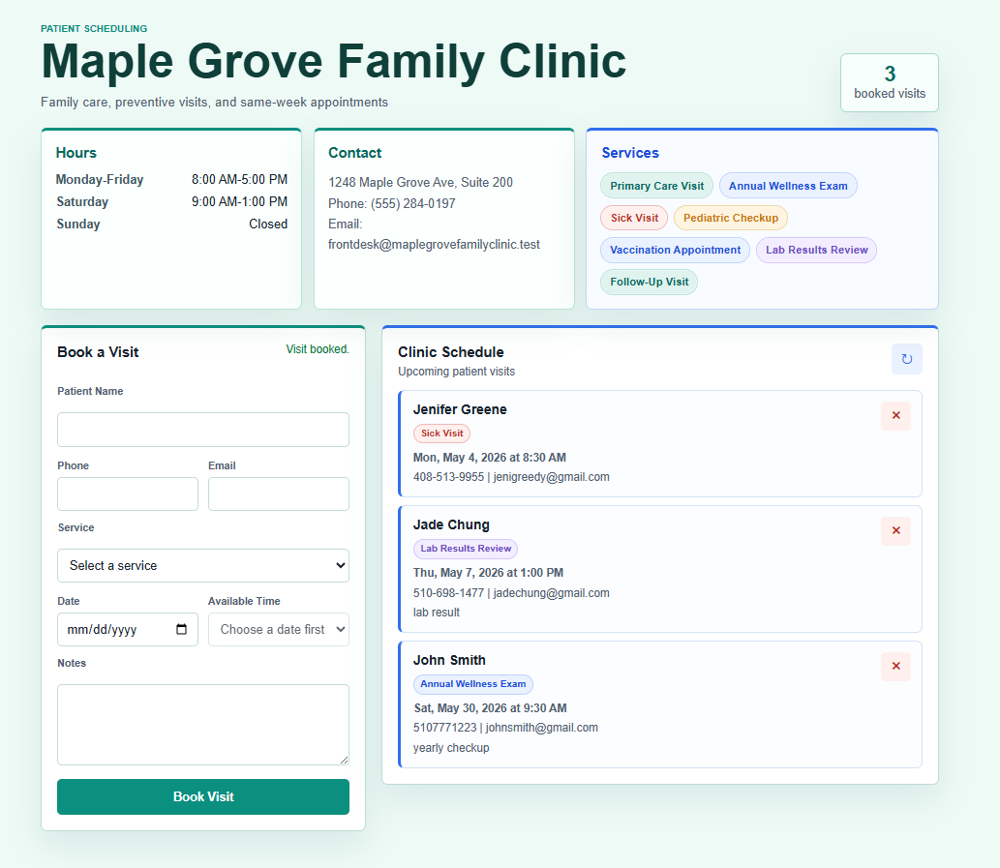

# Maple Grove Family Clinic Appointment App

##  Overview

A patient-facing clinic booking app for Maple Grove Family Clinic with service selection, preset clinic time slots, conflict detection, and persistent storage.

This project is a portfolio demo and is not intended for real patient data.

## Live Demo

[View the deployed app](https://maple-grove-family-clinic.onrender.com/)

## Screenshot



## Features

* Create appointments (POST)
* View all appointments (GET)
* Delete appointments (DELETE)
* Browser UI for booking patient visits
* Clinic hours, contact details, and service list
* Preset weekday and Saturday appointment slots
* Prevent double booking (same date & time)
* Input validation and error handling
* SQLite database for persistent storage

## Tech Stack

* Python
* Flask
* SQLite
* HTML/CSS/JavaScript

## How to Run

```bash
python -m venv .venv
.venv\Scripts\python -m pip install -r requirements.txt
.venv\Scripts\python app.py
```

Open `http://127.0.0.1:5000` in your browser.

## Deploy on Render

This repo includes a `render.yaml` blueprint for Render.

Manual Render settings:

* Service type: Web Service
* Runtime: Python
* Build command: `pip install -r requirements.txt`
* Start command: `gunicorn app:app`
* Health check path: `/health`

The default SQLite database is suitable for a portfolio demo. Do not use this deployment for real patient information.

## API Endpoints

The browser UI is served from `/`.

### GET /appointments

Returns all booked patient visits.

### POST /appointments

Create a new patient visit.

```json
{
  "name": "Jade Chen",
  "phone": "(555) 284-0101",
  "email": "jade@example.com",
  "service": "Primary Care Visit",
  "reason": "Optional notes for the clinic",
  "date": "2026-05-01",
  "time": "10:00"
}
```

Allowed services:

* Primary Care Visit
* Annual Wellness Exam
* Sick Visit
* Pediatric Checkup
* Vaccination Appointment
* Lab Results Review
* Follow-Up Visit

Available appointment slots:

* Monday-Friday: every 30 minutes from 8:00 AM to 4:30 PM
* Saturday: every 30 minutes from 9:00 AM to 12:30 PM
* Sunday: closed

The `reason` field is optional and is shown as patient notes in the schedule.

### DELETE /appointments

Delete an appointment by date and time.

```json
{
  "date": "2026-04-20",
  "time": "10:00"
}
```

### DELETE /appointments/&lt;id&gt;

Delete an appointment by ID.

## Future Improvements

* Add authentication (login system)
* Integrate with voice assistant system
